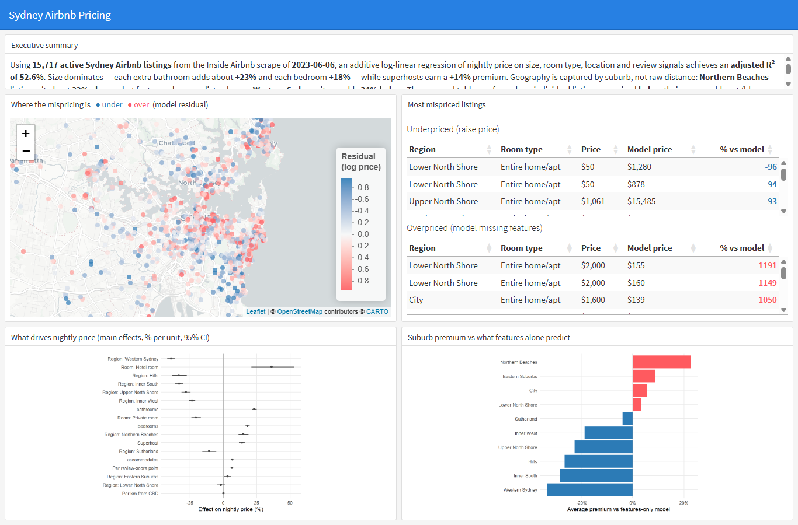

# Sydney Airbnb Pricing

A log-linear regression model of nightly Airbnb prices across Sydney, built as a
COMM3501 Module 1 portfolio project. Three artefacts:

- **[`analysis.Rmd`](analysis.Rmd)** — an R Notebook covering EDA, cleaning,
  feature engineering, three nested models, residual diagnostics, and pricing
  residuals.
- **[`dashboard.Rmd`](dashboard.Rmd)** — a `flexdashboard` with a residual map of
  Sydney, the most-mispriced listings, and effect plots.
- **`README.md`** — this file: executive summary, screenshot, and data citation.

## Executive summary

Using **15,717** active Sydney Airbnb listings from the Inside Airbnb scrape of
**2023-06-06**, I fitted a log-linear regression of nightly price on listing
size, room type, location, and review signals, achieving an adjusted R² of
**52.6%**. Size is the dominant driver — each additional bathroom adds about
**+23%** to the nightly price and each bedroom about **+18%**, while superhost
status carries a **+14%** premium and private rooms sit roughly **20% below**
entire homes. Geography matters by *suburb*, not raw distance (distance-to-CBD
is statistically insignificant once the suburb is known): **Northern Beaches**
listings are priced about **22% above** what features alone predict, whereas
**Western Sydney** sits roughly **34% below**. Hosts of below-model entire-home
listings — concentrated in the blue zones of the dashboard map — should test
modest price increases to align with their local market, while value-conscious
guests get the best feature-for-price deal in the city's western and southern
suburbs.

## Dashboard



The interactive version (`dashboard.html`) renders a Sydney map
coloured by pricing residual (blue = priced below the model, red = above),
a table of the ten most under- and over-priced listings, a coefficient plot of
the main price drivers, and an interaction plot showing how the entire-home
premium varies by region.

## How to reproduce

```r
install.packages(c("tidyverse", "janitor", "skimr", "leaflet",
                   "flexdashboard", "broom", "car", "DT",
                   "scales", "ggthemes", "plotly", "cowplot"))

# 1. The raw Sydney listings.csv.gz (2023-06-06) is already in this repo.
# 2. Render the analysis notebook (produces airbnb_clean.rds + model.rds):
rmarkdown::render("analysis.Rmd")
# 3. Render the dashboard:
rmarkdown::render("dashboard.Rmd")
```

## A note on the data

Inside Airbnb's **most recent** Sydney release (2025-09-12) ships the `price`
column completely blank in both `listings.csv.gz` and `calendar.csv.gz`, so it
cannot support a pricing model. This project therefore uses the most recent
Sydney scrape that still publishes prices, **2023-06-06**.

## Methods and honesty notes

- **Response:** `log(price)`, justified by the EDA (raw price is strongly
  right-skewed; the log is near-normal).
- **Diagnostics are reported honestly.** The residuals show heteroskedasticity
  (a widening funnel) and heavy, non-normal tails; multicollinearity among the
  size variables is moderate (VIFs in the low single digits). None of these
  invalidates the large-sample coefficient inference, but they are flagged
  rather than hidden.
- **Positive residuals are not proof of overcharging.** A listing priced above
  the model usually means the model is missing a feature (harbour view, recent
  renovation), not that the host is greedy.

## Data citation

Data: Inside Airbnb, Sydney listings scraped 2023-06-06.
<https://insideairbnb.com> — released under a Creative Commons licence.

The raw `listings.csv.gz` (Sydney, 2023-06-06) is committed to this repo for full
reproducibility; the cleaned `airbnb_clean.rds` is the modelling input used by the
dashboard.
